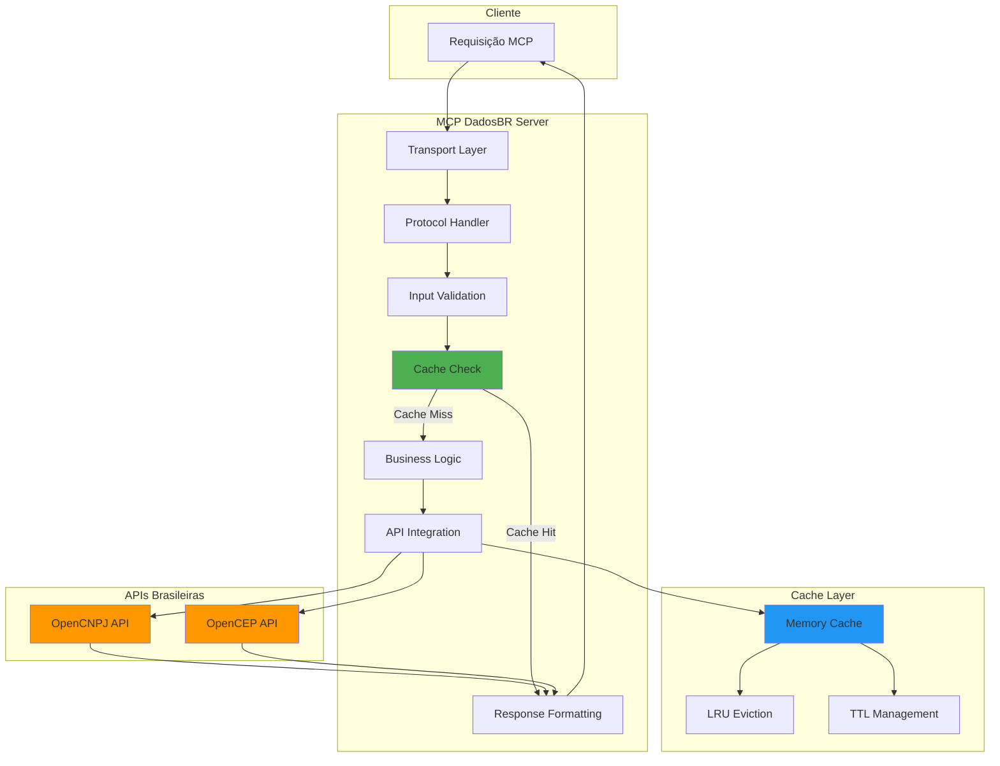
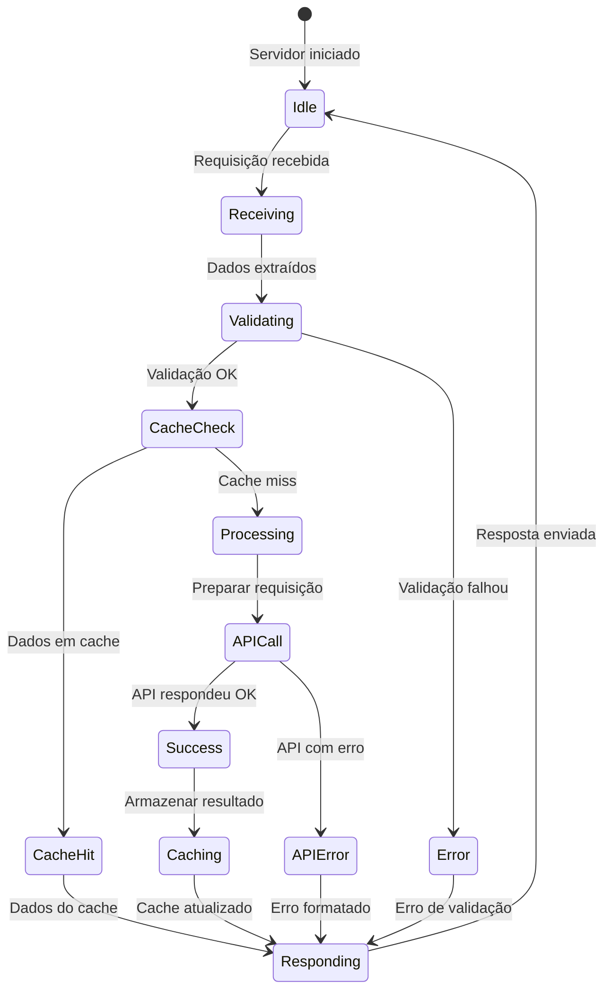
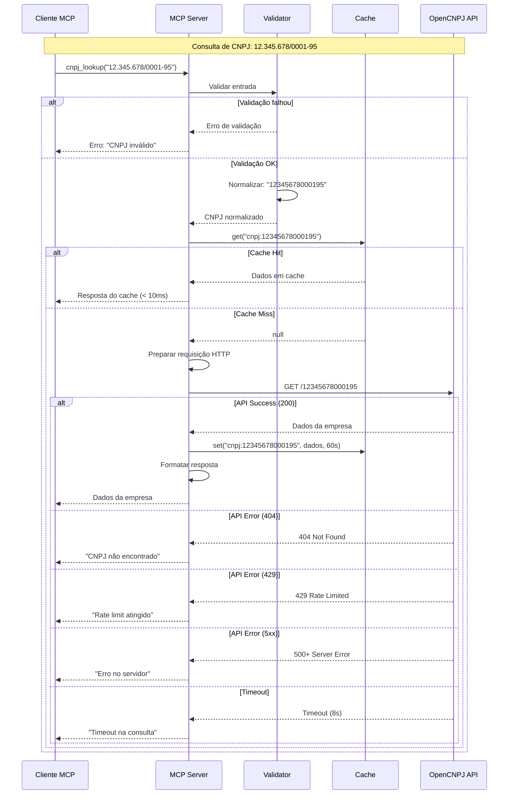
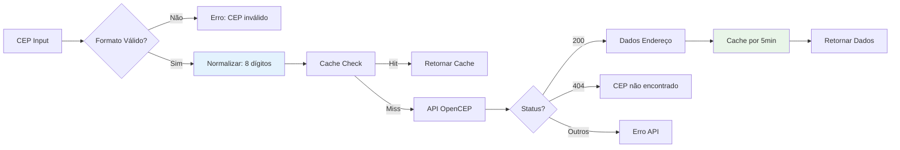
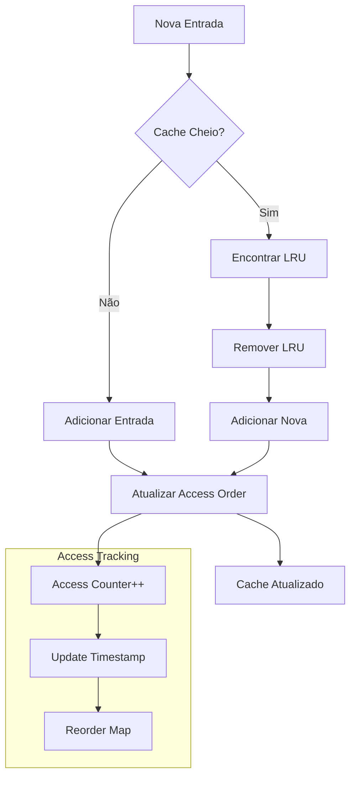
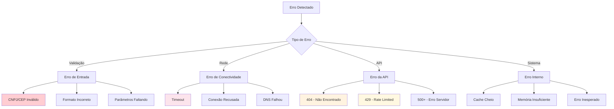

# Fluxo de Dados

> **Metadados do Documento**
> - **Categoria**: Arquitetura
> - **Nível**: Avançado
> - **Tempo de Leitura**: 15 minutos
> - **Última Atualização**: ${new Date().toLocaleDateString('pt-BR')}
> - **Versão**: 1.0.0

## 📋 Índice

- [Visão Geral do Fluxo](#visão-geral-do-fluxo)
- [Fluxo de Requisição CNPJ](#fluxo-de-requisição-cnpj)
- [Fluxo de Requisição CEP](#fluxo-de-requisição-cep)
- [Gerenciamento de Cache](#gerenciamento-de-cache)
- [Tratamento de Erros](#tratamento-de-erros)
- [Otimizações Brasileiras](#otimizações-brasileiras)

## 🎯 Visão Geral do Fluxo

### Arquitetura de Fluxo Completa



### Estados do Sistema



## 🏢 Fluxo de Requisição CNPJ

### Sequência Completa



### Detalhamento por Etapa

#### 1. **Recepção e Parsing**

```typescript
// Entrada: Requisição MCP bruta
const requisicaoMCP = {
  method: "tools/call",
  params: {
    name: "cnpj_lookup",
    arguments: {
      cnpj: "12.345.678/0001-95"
    }
  }
};

// Processamento inicial
const { name, arguments: args } = requisicaoMCP.params;
console.log(`[${new Date().toISOString()}] [cnpj_lookup] [${args.cnpj}] [iniciado]`);
```

#### 2. **Validação e Normalização**

```typescript
// Validação com Zod
try {
  const { cnpj } = CnpjSchema.parse(args);
  // cnpj agora é "12345678000195" (normalizado)
  
  console.log(`[${new Date().toISOString()}] [cnpj_lookup] [${cnpj}] [validado]`);
} catch (error) {
  console.log(`[${new Date().toISOString()}] [cnpj_lookup] [${args.cnpj}] [erro_validacao] [${error.message}]`);
  return { error: error.message };
}
```

#### 3. **Verificação de Cache**

```typescript
// Gerar chave de cache
const chaveCache = `cnpj:${cnpj}`;

// Verificar cache
const dadosCache = cache.get(chaveCache);
if (dadosCache) {
  console.log(`[${new Date().toISOString()}] [cnpj_lookup] [${cnpj}] [cache_hit] [0ms]`);
  return dadosCache;
}

console.log(`[${new Date().toISOString()}] [cnpj_lookup] [${cnpj}] [cache_miss]`);
```

#### 4. **Requisição à API**

```typescript
// Preparar requisição com timeout
const controller = new AbortController();
const timeoutId = setTimeout(() => controller.abort(), TIMEOUT_PADRAO);
const inicioRequisicao = Date.now();

try {
  const response = await fetch(`${API_URLS.CNPJ}/${cnpj}`, {
    signal: controller.signal,
    headers: {
      'User-Agent': 'MCP-DadosBR/1.2.0',
      'Accept': 'application/json'
    }
  });
  
  const tempoResposta = Date.now() - inicioRequisicao;
  clearTimeout(timeoutId);
  
  console.log(`[${new Date().toISOString()}] [cnpj_lookup] [${cnpj}] [api_response] [${response.status}] [${tempoResposta}ms]`);
} catch (error) {
  const tempoResposta = Date.now() - inicioRequisicao;
  console.log(`[${new Date().toISOString()}] [cnpj_lookup] [${cnpj}] [api_error] [${error.name}] [${tempoResposta}ms]`);
}
```

#### 5. **Processamento da Resposta**

```typescript
// Mapear status HTTP para mensagens brasileiras
const processarResposta = (response: Response, dados: any) => {
  switch (response.status) {
    case 200:
      return {
        ok: true,
        data: dados,
        fonte: API_URLS.CNPJ,
        timestamp: new Date().toISOString()
      };
      
    case 404:
      return {
        ok: false,
        error: "CNPJ não encontrado na base de dados",
        codigo: 'CNPJ_NOT_FOUND'
      };
      
    case 429:
      return {
        ok: false,
        error: "Muitas requisições. Tente novamente em alguns segundos",
        codigo: 'RATE_LIMIT'
      };
      
    default:
      return {
        ok: false,
        error: `Erro HTTP ${response.status}: ${response.statusText}`,
        codigo: 'HTTP_ERROR'
      };
  }
};
```

#### 6. **Armazenamento em Cache**

```typescript
// Armazenar apenas sucessos no cache
if (resultado.ok) {
  cache.set(chaveCache, resultado, CACHE_TTL_CNPJ);
  console.log(`[${new Date().toISOString()}] [cnpj_lookup] [${cnpj}] [cached] [${CACHE_TTL_CNPJ}ms]`);
}
```

## 📮 Fluxo de Requisição CEP

### Diferenças do Fluxo CNPJ



### Características Específicas do CEP

#### **TTL Diferenciado**
```typescript
// CEP tem TTL maior (dados mais estáveis)
const CACHE_TTL_CEP = 5 * 60 * 1000; // 5 minutos vs 60s do CNPJ

// Justificativa: CEPs mudam muito raramente
cache.set(`cep:${cep}`, resultado, CACHE_TTL_CEP);
```

#### **Validação Específica**
```typescript
// Validação de CEP brasileiro
const CepSchema = z.object({
  cep: z.string()
    .regex(/^\d{5}-?\d{3}$/, "CEP deve ter formato XXXXX-XXX")
    .transform(cep => cep.replace(/\D/g, ""))
    .refine(cep => cep.length === 8, "CEP deve ter 8 dígitos")
});
```

#### **Estrutura de Resposta**
```typescript
// Resposta padronizada para CEP
interface RespostaCep {
  ok: true;
  data: {
    cep: string;
    logradouro: string;
    bairro: string;
    cidade: string;
    uf: string; // Estados brasileiros
    complemento?: string;
  };
  fonte: string;
  timestamp: string;
}
```

## 💾 Gerenciamento de Cache

### Algoritmo LRU Detalhado



### Implementação do Cache

```typescript
class MemoryCache {
  private cache = new Map<string, CacheEntry>();
  private accessOrder = new Map<string, number>();
  private accessCounter = 0;
  private readonly maxSize = 256;

  // Estatísticas para monitoramento
  private stats = {
    hits: 0,
    misses: 0,
    evictions: 0,
    cleanups: 0
  };

  get(key: string): unknown | null {
    const entry = this.cache.get(key);
    
    if (!entry) {
      this.stats.misses++;
      return null;
    }

    // Verificar expiração
    if (Date.now() > entry.expires) {
      this.cache.delete(key);
      this.accessOrder.delete(key);
      this.stats.misses++;
      return null;
    }

    // Atualizar LRU
    this.accessOrder.set(key, ++this.accessCounter);
    this.stats.hits++;
    
    return entry.data;
  }

  set(key: string, value: unknown, ttl: number): void {
    // Implementar LRU se necessário
    if (this.cache.size >= this.maxSize) {
      this.evictLRU();
    }

    this.cache.set(key, {
      data: value,
      expires: Date.now() + ttl
    });

    this.accessOrder.set(key, ++this.accessCounter);
  }

  private evictLRU(): void {
    let oldestKey = "";
    let oldestAccess = Infinity;

    for (const [key, access] of this.accessOrder) {
      if (access < oldestAccess) {
        oldestAccess = access;
        oldestKey = key;
      }
    }

    if (oldestKey) {
      this.cache.delete(oldestKey);
      this.accessOrder.delete(oldestKey);
      this.stats.evictions++;
    }
  }

  // Cleanup periódico (executado a cada minuto)
  cleanup(): void {
    const now = Date.now();
    const keysToDelete: string[] = [];

    for (const [key, entry] of this.cache) {
      if (now > entry.expires) {
        keysToDelete.push(key);
      }
    }

    for (const key of keysToDelete) {
      this.cache.delete(key);
      this.accessOrder.delete(key);
    }

    this.stats.cleanups++;
  }

  getStats() {
    const hitRate = this.stats.hits / (this.stats.hits + this.stats.misses);
    
    return {
      size: this.cache.size,
      maxSize: this.maxSize,
      hits: this.stats.hits,
      misses: this.stats.misses,
      hitRate: isNaN(hitRate) ? 0 : hitRate,
      evictions: this.stats.evictions,
      cleanups: this.stats.cleanups
    };
  }
}
```

### Estratégias de Cache por Tipo

```typescript
// TTLs otimizados para dados brasileiros
const CACHE_STRATEGIES = {
  // Dados empresariais (mudam ocasionalmente)
  CNPJ: {
    ttl: 60 * 1000,        // 60 segundos
    reason: "Situação cadastral pode mudar"
  },
  
  // Dados de endereço (praticamente estáticos)
  CEP: {
    ttl: 5 * 60 * 1000,   // 5 minutos
    reason: "CEPs raramente mudam"
  },
  
  // Cache de erros (retry rápido)
  ERROR: {
    ttl: 10 * 1000,       // 10 segundos
    reason: "Permitir retry rápido"
  },
  
  // Rate limit (baseado no header Retry-After)
  RATE_LIMIT: {
    ttl: 60 * 1000,       // 60 segundos padrão
    reason: "Respeitar rate limiting"
  }
} as const;
```

## ⚠️ Tratamento de Erros

### Hierarquia de Erros



### Mapeamento de Erros

```typescript
// Mapeamento de erros para mensagens em português
const ERROR_MAPPING = {
  // Erros de validação
  VALIDATION_ERROR: {
    message: "Dados de entrada inválidos",
    code: "VALIDATION_ERROR",
    severity: "user_error"
  },
  
  // Erros de API
  CNPJ_NOT_FOUND: {
    message: "CNPJ não encontrado na base de dados da Receita Federal",
    code: "CNPJ_NOT_FOUND", 
    severity: "not_found"
  },
  
  CEP_NOT_FOUND: {
    message: "CEP não encontrado na base dos Correios",
    code: "CEP_NOT_FOUND",
    severity: "not_found"
  },
  
  RATE_LIMIT: {
    message: "Muitas requisições. Aguarde alguns segundos e tente novamente",
    code: "RATE_LIMIT",
    severity: "rate_limited"
  },
  
  // Erros de rede
  TIMEOUT: {
    message: "Timeout na consulta. Verifique sua conexão com a internet",
    code: "TIMEOUT",
    severity: "network_error"
  },
  
  NETWORK_ERROR: {
    message: "Erro de rede. Tente novamente mais tarde",
    code: "NETWORK_ERROR", 
    severity: "network_error"
  },
  
  // Erros do servidor
  SERVER_ERROR: {
    message: "Erro interno do servidor. Nossa equipe foi notificada",
    code: "SERVER_ERROR",
    severity: "server_error"
  }
} as const;
```

### Logging Estruturado

```typescript
// Formato de log padronizado
function logOperacao(
  ferramenta: string,
  entrada: string,
  status: 'success' | 'error' | 'cache_hit',
  tempoMs: number,
  detalhes?: string
) {
  const timestamp = new Date().toISOString();
  const transporte = process.env.MCP_TRANSPORT || 'stdio';
  
  const logEntry = `[${timestamp}] [${ferramenta}] [${entrada}] [${status}] [${tempoMs}ms] [${transporte}]`;
  
  if (detalhes) {
    console.log(`${logEntry} ${detalhes}`);
  } else {
    console.log(logEntry);
  }
}

// Exemplos de uso
logOperacao('cnpj_lookup', '12345678000195', 'success', 245);
logOperacao('cep_lookup', '01310100', 'cache_hit', 2);
logOperacao('cnpj_lookup', '00000000000000', 'error', 1205, 'CNPJ_NOT_FOUND');
```

## 🇧🇷 Otimizações Brasileiras

### 1. **Timeout Adaptativo**

```typescript
// Timeouts otimizados para latência brasileira
const TIMEOUTS = {
  // Baseado em testes reais com APIs brasileiras
  DEFAULT: 8000,     // 8s - latência média Brasil
  FAST: 3000,        // 3s - para cache warming
  SLOW: 15000,       // 15s - para retry em horário de pico
  
  // Ajuste por região (futuro)
  SUDESTE: 5000,     // Menor latência
  NORDESTE: 10000,   // Maior latência
  NORTE: 12000       // Maior latência
};
```

### 2. **Cache Inteligente por Padrão de Uso**

```typescript
// Análise de padrões brasileiros
const CACHE_PATTERNS = {
  // CNPJs mais consultados (grandes empresas)
  POPULAR_CNPJS: new Set([
    '33000167000101', // Petrobras
    '60746948000112', // Vale
    '02558157000162'  // Itaú
  ]),
  
  // CEPs metropolitanos (maior volume)
  METRO_CEPS: /^(01|02|03|04|05|08|09|20|21|22|23|24|40|41|50|51|52|70|80|81|90|91)/,
  
  // TTL diferenciado
  getTTL(tipo: 'cnpj' | 'cep', valor: string): number {
    if (tipo === 'cnpj' && this.POPULAR_CNPJS.has(valor)) {
      return 5 * 60 * 1000; // 5 minutos para empresas populares
    }
    
    if (tipo === 'cep' && this.METRO_CEPS.test(valor)) {
      return 10 * 60 * 1000; // 10 minutos para CEPs metropolitanos
    }
    
    return tipo === 'cnpj' ? 60 * 1000 : 5 * 60 * 1000;
  }
};
```

### 3. **Fallback e Resilência**

```typescript
// Sistema de fallback para APIs brasileiras
class APIFallback {
  private readonly endpoints = {
    cnpj: [
      'https://api.opencnpj.org',
      'https://receitaws.com.br/v1/cnpj', // Fallback
    ],
    cep: [
      'https://opencep.com/v1',
      'https://viacep.com.br/ws',         // Fallback
    ]
  };

  async fetchWithFallback(tipo: 'cnpj' | 'cep', valor: string): Promise<any> {
    const endpoints = this.endpoints[tipo];
    
    for (let i = 0; i < endpoints.length; i++) {
      try {
        const response = await this.tryEndpoint(endpoints[i], valor);
        
        if (i > 0) {
          console.log(`[FALLBACK] Usando endpoint ${i + 1} para ${tipo}`);
        }
        
        return response;
      } catch (error) {
        console.log(`[FALLBACK] Endpoint ${i + 1} falhou: ${error.message}`);
        
        if (i === endpoints.length - 1) {
          throw new Error('Todos os endpoints falharam');
        }
      }
    }
  }
}
```

## 🚀 Próximos Passos

Agora que você entende o fluxo de dados:

1. **[Limitações e Benefícios](limitacoes-beneficios.md)** - Trade-offs arquiteturais
2. **[Padrões de Implementação](../desenvolvimento/padroes-implementacao.md)** - Como implementar seguindo estes fluxos
3. **[Exemplos Práticos](../exemplos/basicos/)** - Ver os fluxos em ação

---

**💡 Insight**: O fluxo de dados foi otimizado especificamente para o contexto brasileiro - latência de rede, padrões de uso e características das APIs nacionais.

**🏷️ Tags**: fluxo-dados, cache, performance, apis-brasileiras, mcp