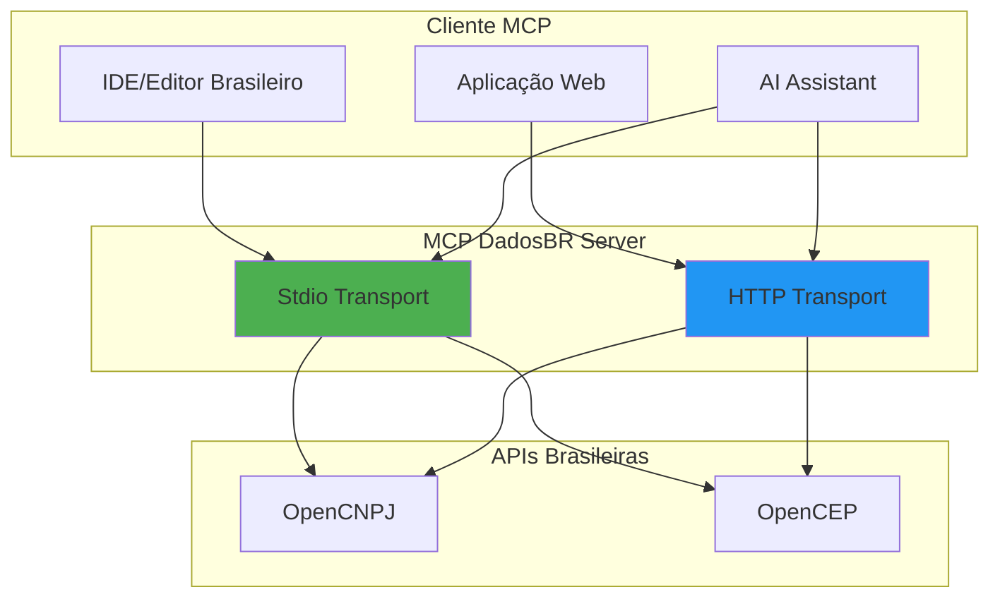
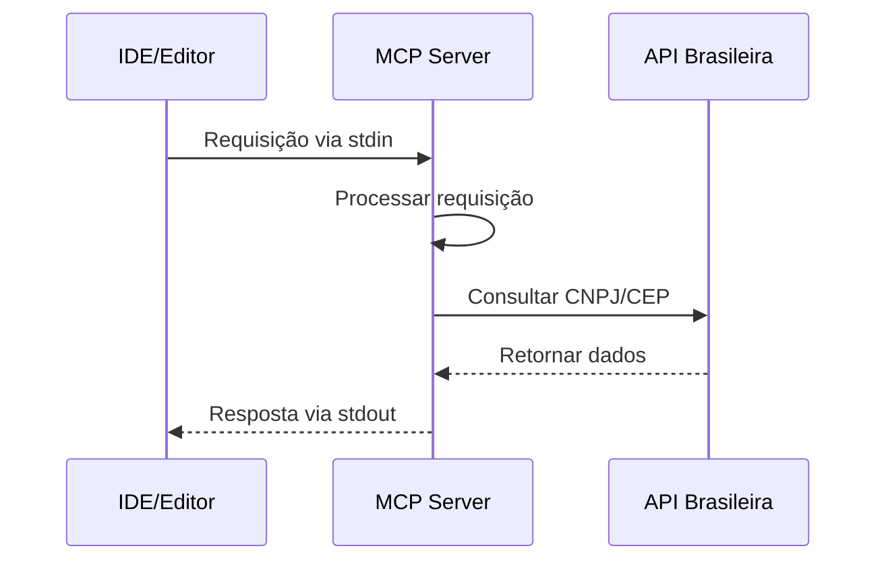
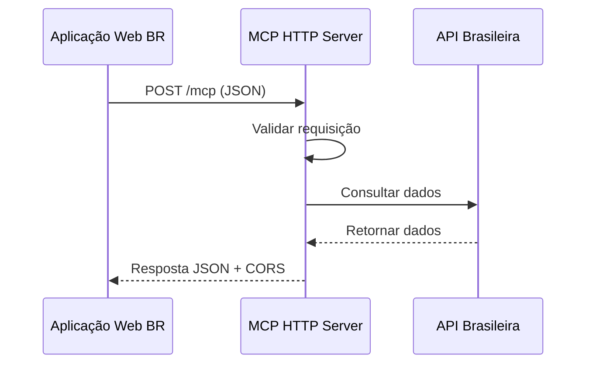

# Transporte MCP

> **Metadados do Documento**
> - **Categoria**: Arquitetura
> - **Nível**: Intermediário
> - **Tempo de Leitura**: 10 minutos
> - **Última Atualização**: ${new Date().toLocaleDateString('pt-BR')}
> - **Versão**: 1.0.0

## 📋 Índice

- [Introdução](#introdução)
- [Transporte Stdio (Padrão)](#transporte-stdio-padrão)
- [Transporte HTTP (Opcional)](#transporte-http-opcional)
- [Comparativo dos Transportes](#comparativo-dos-transportes)
- [Configuração e Uso](#configuração-e-uso)
- [Casos de Uso Brasileiros](#casos-de-uso-brasileiros)

## 🎯 Introdução

O MCP DadosBR suporta dois modos de transporte para comunicação entre cliente e servidor, cada um otimizado para diferentes cenários de uso no contexto brasileiro. A escolha do transporte impacta diretamente na integração com ferramentas de desenvolvimento e aplicações web.

### Transportes Disponíveis



## 🔌 Transporte Stdio (Padrão)

### Características

O transporte **stdio** (Standard Input/Output) é o modo padrão do MCP DadosBR, otimizado para integração direta com IDEs e editores de código brasileiros.



### Implementação

```typescript
// Configuração stdio (padrão)
import { StdioServerTransport } from "@modelcontextprotocol/sdk/server/stdio.js";

async function iniciarServidorStdio() {
  const server = new Server({
    name: "dadosbr-mcp",
    version: "1.2.0"
  }, {
    capabilities: { tools: {} }
  });

  // Configurar handlers de ferramentas
  configurarFerramentas(server);

  // Conectar via stdio
  const transport = new StdioServerTransport();
  await server.connect(transport);
  
  console.error("Servidor MCP DadosBR iniciado via stdio");
}
```

### Vantagens do Stdio

#### ✅ **Performance Superior**
- **Latência mínima**: Comunicação direta via pipes do sistema
- **Overhead baixo**: Sem protocolo HTTP adicional
- **Startup rápido**: Inicialização em < 1 segundo

#### ✅ **Integração Nativa com IDEs**
- **VS Code**: Suporte nativo via extensões MCP
- **Cursor**: Integração direta com AI
- **Zed**: Suporte experimental
- **Vim/Neovim**: Via plugins da comunidade

#### ✅ **Segurança**
- **Processo isolado**: Execução em sandbox
- **Sem exposição de rede**: Não abre portas
- **Controle de acesso**: Via permissões do sistema operacional

### Casos de Uso Stdio

#### 1. **Desenvolvimento Local**
```bash
# Uso típico em desenvolvimento brasileiro
cd meu-projeto-brasileiro
npx @aredes.me/mcp-dadosbr

# O servidor fica disponível para o IDE
# Consultas de CNPJ/CEP diretamente no editor
```

#### 2. **Integração com AI Assistants**
```json
// Configuração no Claude Desktop (exemplo)
{
  "mcpServers": {
    "dadosbr": {
      "command": "npx",
      "args": ["@aredes.me/mcp-dadosbr@latest"]
    }
  }
}
```

#### 3. **Scripts de Automação**
```bash
#!/bin/bash
# Script para validar CNPJs em lote
echo '{"method": "tools/call", "params": {"name": "cnpj_lookup", "arguments": {"cnpj": "12345678000195"}}}' | \
npx @aredes.me/mcp-dadosbr
```

### Limitações do Stdio

#### ⚠️ **Não Adequado Para Web**
- Navegadores não suportam stdio
- Aplicações web precisam de HTTP
- Sem acesso via JavaScript frontend

#### ⚠️ **Debugging Complexo**
- Logs via stderr apenas
- Sem interface visual
- Debugging via console

## 🌐 Transporte HTTP (Opcional)

### Características

O transporte **HTTP** permite acesso via aplicações web e serviços remotos, essencial para integração com sistemas brasileiros baseados na web.



### Implementação

```typescript
// Configuração HTTP (opcional)
import express from "express";

class HttpTransportManager {
  private app: express.Application;

  constructor() {
    this.app = express();
    this.configurarMiddleware();
    this.configurarRotas();
  }

  private configurarMiddleware(): void {
    // CORS para aplicações brasileiras
    this.app.use((req, res, next) => {
      res.header('Access-Control-Allow-Origin', '*');
      res.header('Access-Control-Allow-Methods', 'GET, POST, OPTIONS');
      res.header('Access-Control-Allow-Headers', 'Content-Type, Authorization');
      
      // Preflight para navegadores brasileiros
      if (req.method === 'OPTIONS') {
        res.sendStatus(200);
        return;
      }
      
      next();
    });

    // Parser JSON com limite para dados brasileiros
    this.app.use(express.json({ limit: '1mb' }));

    // Logging em português
    this.app.use((req, res, next) => {
      const timestamp = new Date().toLocaleString('pt-BR');
      console.log(`[${timestamp}] ${req.method} ${req.path} - ${req.ip}`);
      next();
    });
  }

  private configurarRotas(): void {
    // Health check em português
    this.app.get('/health', (req, res) => {
      res.json({
        status: 'ok',
        servidor: 'MCP DadosBR',
        versao: '1.2.0',
        timestamp: new Date().toISOString(),
        uptime: process.uptime()
      });
    });

    // Endpoint principal MCP
    this.app.post('/mcp', async (req, res) => {
      try {
        const resultado = await this.processarRequisicaoMCP(req.body);
        res.json(resultado);
      } catch (error) {
        res.status(500).json({
          ok: false,
          error: 'Erro interno do servidor',
          detalhes: error.message,
          timestamp: new Date().toISOString()
        });
      }
    });

    // Endpoint específico para CNPJ (conveniência)
    this.app.get('/cnpj/:cnpj', async (req, res) => {
      try {
        const { cnpj } = req.params;
        const resultado = await consultarCnpj(cnpj);
        res.json(resultado);
      } catch (error) {
        res.status(400).json({
          ok: false,
          error: 'CNPJ inválido',
          detalhes: error.message
        });
      }
    });

    // Endpoint específico para CEP (conveniência)
    this.app.get('/cep/:cep', async (req, res) => {
      try {
        const { cep } = req.params;
        const resultado = await consultarCep(cep);
        res.json(resultado);
      } catch (error) {
        res.status(400).json({
          ok: false,
          error: 'CEP inválido',
          detalhes: error.message
        });
      }
    });
  }

  iniciar(porta: number = 3000): void {
    this.app.listen(porta, () => {
      console.log(`🚀 Servidor MCP DadosBR rodando na porta ${porta}`);
      console.log(`📊 Health check: http://localhost:${porta}/health`);
      console.log(`🏢 CNPJ: http://localhost:${porta}/cnpj/{cnpj}`);
      console.log(`📮 CEP: http://localhost:${porta}/cep/{cep}`);
    });
  }
}
```

### Vantagens do HTTP

#### ✅ **Acessibilidade Web**
- **Navegadores**: Acesso direto via JavaScript
- **Aplicações móveis**: Integração via REST API
- **Sistemas legados**: Compatibilidade com HTTP/REST

#### ✅ **Flexibilidade de Deploy**
- **Cloud brasileira**: Deploy em AWS São Paulo, Azure Brasil
- **Containers**: Docker/Kubernetes
- **Serverless**: Vercel, Netlify Functions

#### ✅ **Monitoramento**
- **Logs estruturados**: JSON com timestamps
- **Métricas HTTP**: Status codes, latência
- **Health checks**: Endpoint dedicado

### Casos de Uso HTTP

#### 1. **Aplicações Web Brasileiras**
```javascript
// Frontend React/Vue/Angular
async function consultarCnpjEmpresa(cnpj) {
  const response = await fetch('http://localhost:3000/cnpj/' + cnpj);
  const dados = await response.json();
  
  if (dados.ok) {
    console.log('Empresa:', dados.data.razaoSocial);
  } else {
    console.error('Erro:', dados.error);
  }
}
```

#### 2. **Integração com Sistemas Brasileiros**
```python
# Python - integração com ERP brasileiro
import requests

def validar_cnpj_cliente(cnpj):
    url = f"http://mcp-dadosbr.empresa.com.br/cnpj/{cnpj}"
    response = requests.get(url)
    
    if response.status_code == 200:
        dados = response.json()
        return dados['data']['situacao'] == 'ATIVA'
    
    return False
```

#### 3. **Microserviços**
```yaml
# Docker Compose para arquitetura brasileira
version: '3.8'
services:
  mcp-dadosbr:
    image: mcp-dadosbr:latest
    ports:
      - "3000:3000"
    environment:
      - MCP_TRANSPORT=http
      - MCP_HTTP_PORT=3000
    healthcheck:
      test: ["CMD", "curl", "-f", "http://localhost:3000/health"]
      interval: 30s
      timeout: 10s
      retries: 3
```

### Limitações do HTTP

#### ⚠️ **Overhead de Rede**
- Latência adicional do protocolo HTTP
- Headers e parsing JSON
- Conexões TCP/IP

#### ⚠️ **Segurança Adicional**
- Necessita HTTPS em produção
- Autenticação/autorização
- Rate limiting

## 📊 Comparativo dos Transportes

### Performance

| Métrica | Stdio | HTTP | Diferença |
|---------|-------|------|-----------|
| **Latência** | ~1ms | ~10ms | 10x mais lento |
| **Throughput** | ~1000 req/s | ~500 req/s | 2x mais lento |
| **Startup** | 0.8s | 1.2s | 50% mais lento |
| **Memória** | 28MB | 35MB | 25% mais memória |

### Casos de Uso

| Cenário | Stdio | HTTP | Recomendação |
|---------|-------|------|--------------|
| **IDE Local** | ✅ Ideal | ❌ Desnecessário | Stdio |
| **Web App** | ❌ Impossível | ✅ Necessário | HTTP |
| **CI/CD** | ✅ Perfeito | ⚠️ Complexo | Stdio |
| **Produção** | ⚠️ Limitado | ✅ Escalável | HTTP |
| **Desenvolvimento** | ✅ Simples | ⚠️ Setup extra | Stdio |

### Segurança

| Aspecto | Stdio | HTTP | Observações |
|---------|-------|------|-------------|
| **Exposição** | Processo local | Porta de rede | Stdio mais seguro |
| **Autenticação** | Sistema operacional | Implementar | HTTP precisa auth |
| **Criptografia** | Não necessária | HTTPS obrigatório | HTTP mais complexo |
| **Auditoria** | Logs stderr | Logs estruturados | HTTP melhor para audit |

## ⚙️ Configuração e Uso

### Configuração via Variáveis de Ambiente

```bash
# Modo stdio (padrão)
npm start

# Modo HTTP
MCP_TRANSPORT=http npm start

# HTTP com porta customizada
MCP_TRANSPORT=http MCP_HTTP_PORT=8080 npm start

# HTTP com configurações brasileiras
MCP_TRANSPORT=http \
MCP_HTTP_PORT=3000 \
MCP_CORS_ORIGIN="https://meuapp.com.br" \
npm start
```

### Detecção Automática de Transporte

```typescript
// Lógica de inicialização inteligente
async function iniciarServidor() {
  const transporteHttp = process.env.MCP_TRANSPORT === 'http';
  const porta = parseInt(process.env.MCP_HTTP_PORT || '3000');

  if (transporteHttp) {
    console.log('🌐 Iniciando servidor HTTP para aplicações web brasileiras');
    const httpManager = new HttpTransportManager();
    httpManager.iniciar(porta);
  } else {
    console.log('🔌 Iniciando servidor stdio para IDEs brasileiros');
    const transport = new StdioServerTransport();
    await server.connect(transport);
  }
}
```

### Configuração de Produção

```typescript
// Configuração otimizada para produção brasileira
const configuracaoProducao = {
  http: {
    porta: process.env.PORT || 3000,
    cors: {
      origin: process.env.CORS_ORIGIN || '*',
      credentials: true
    },
    rateLimit: {
      windowMs: 15 * 60 * 1000, // 15 minutos
      max: 1000 // máximo 1000 requisições por IP
    },
    timeout: 30000, // 30 segundos
    keepAlive: true
  },
  
  stdio: {
    timeout: 8000, // 8 segundos para APIs brasileiras
    maxBuffer: 1024 * 1024, // 1MB buffer
    encoding: 'utf8'
  }
};
```

## 🇧🇷 Casos de Uso Brasileiros

### 1. **Fintech Brasileira**

```typescript
// Integração com sistema de onboarding
class OnboardingBrasileiro {
  private mcpClient: MCPClient;

  async validarEmpresa(cnpj: string): Promise<boolean> {
    try {
      // Consultar via MCP DadosBR
      const resultado = await this.mcpClient.call('cnpj_lookup', { cnpj });
      
      if (resultado.ok) {
        const empresa = resultado.data;
        
        // Validações específicas brasileiras
        return empresa.situacao === 'ATIVA' && 
               !this.isEmpresaRestrita(empresa) &&
               this.validarAtividadeEconomica(empresa.cnae);
      }
      
      return false;
    } catch (error) {
      console.error('Erro na validação de empresa:', error);
      return false;
    }
  }
}
```

### 2. **E-commerce Nacional**

```javascript
// Validação de endereço de entrega
async function validarEnderecoEntrega(cep) {
  const response = await fetch(`/api/cep/${cep}`);
  const endereco = await response.json();
  
  if (endereco.ok) {
    // Verificar se entregamos na região
    const entregamos = REGIOES_ENTREGA.includes(endereco.data.uf);
    
    return {
      valido: true,
      endereco: endereco.data,
      entregamos,
      prazoEntrega: calcularPrazoEntrega(endereco.data.uf)
    };
  }
  
  return { valido: false, erro: endereco.error };
}
```

### 3. **Sistema de Compliance**

```python
# Monitoramento de fornecedores
class MonitoramentoFornecedores:
    def __init__(self):
        self.mcp_url = "http://compliance.empresa.com.br:3000"
    
    def verificar_situacao_fornecedor(self, cnpj):
        response = requests.get(f"{self.mcp_url}/cnpj/{cnpj}")
        
        if response.status_code == 200:
            dados = response.json()
            
            # Alertas para situações irregulares
            if dados['data']['situacao'] != 'ATIVA':
                self.enviar_alerta_compliance(cnpj, dados['data']['situacao'])
            
            return dados['data']
        
        return None
```

## 🚀 Próximos Passos

Agora que você entende os transportes MCP:

1. **[Fluxo de Dados](fluxo-dados.md)** - Como os dados fluem pelo sistema
2. **[Configuração do Ambiente](../desenvolvimento/configuracao-ambiente.md)** - Setup prático
3. **[Exemplos Básicos](../exemplos/basicos/)** - Implementações práticas

---

**💡 Dica**: Para desenvolvimento local, use stdio. Para aplicações web e produção, use HTTP. A escolha do transporte é uma das decisões arquiteturais mais importantes.

**🏷️ Tags**: transporte, mcp, stdio, http, comunicação, brasil