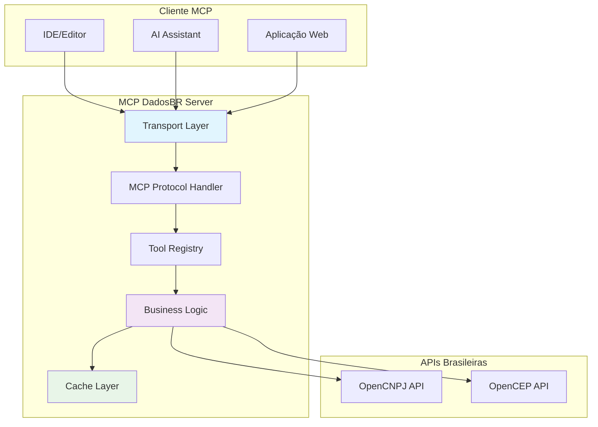
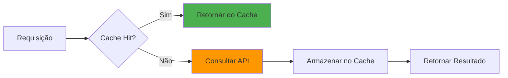
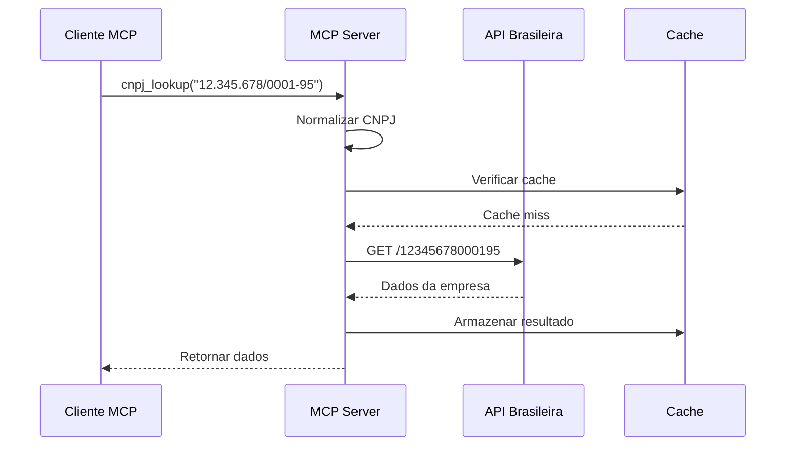
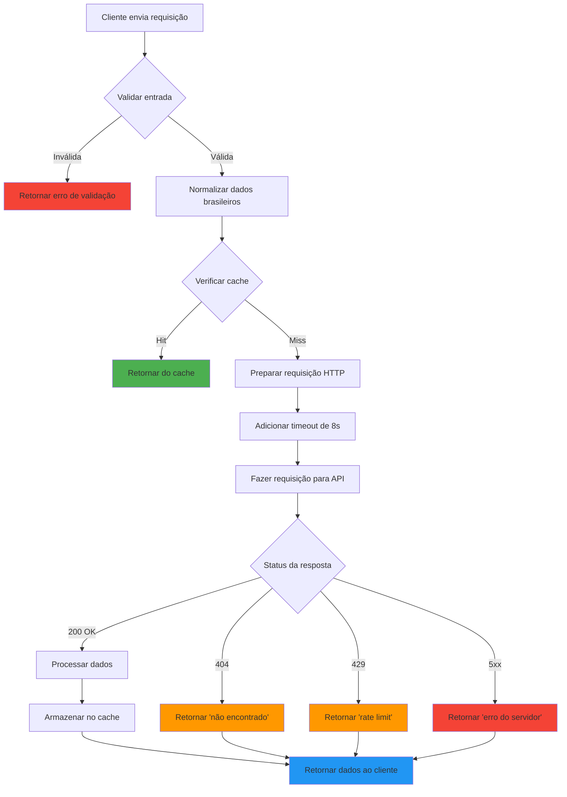
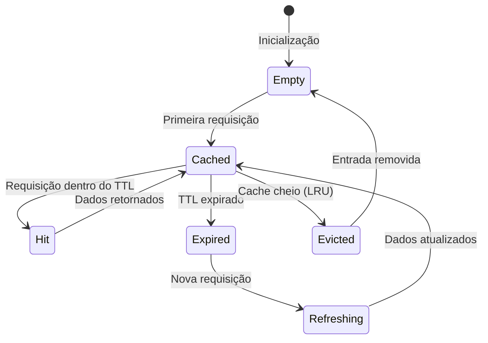

# Visão Geral da Arquitetura

> **Metadados do Documento**
> - **Categoria**: Arquitetura
> - **Nível**: Intermediário
> - **Tempo de Leitura**: 8 minutos
> - **Última Atualização**: ${new Date().toLocaleDateString('pt-BR')}
> - **Versão**: 1.0.0

## 📋 Índice

- [Introdução](#introdução)
- [Princípios Arquiteturais](#princípios-arquiteturais)
- [Visão Geral do Sistema](#visão-geral-do-sistema)
- [Componentes Principais](#componentes-principais)
- [Fluxo de Dados](#fluxo-de-dados)
- [Decisões Arquiteturais](#decisões-arquiteturais)
- [Próximos Passos](#próximos-passos)

## 🎯 Introdução

O MCP DadosBR foi projetado seguindo uma filosofia de **simplicidade radical** e **eficiência operacional**. Esta arquitetura foi especialmente pensada para desenvolvedores brasileiros que precisam de uma solução direta, confiável e fácil de manter para acessar dados públicos nacionais.

### Pré-requisitos

- Conhecimento básico de TypeScript/JavaScript
- Familiaridade com conceitos de API REST
- Entendimento básico do protocolo MCP
- Conhecimento sobre dados brasileiros (CNPJ, CEP)

### O que você vai aprender

- Como a arquitetura de arquivo único funciona na prática
- Por que escolhemos esta abordagem para dados brasileiros
- Como os componentes interagem entre si
- Quais são as limitações e benefícios desta arquitetura

## 💡 Princípios Arquiteturais

### 1. Simplicidade Acima de Tudo (KISS)


**Filosofia**: "Keep It Simple, Stupid" - preferimos uma solução simples que funciona a uma complexa que pode falhar.

**Aplicação Prática**:
- Um único arquivo `server.ts` com toda a lógica
- Máximo de 300 linhas de código
- Dependências mínimas e bem estabelecidas
- Funções puras sempre que possível

### 2. Eficiência para Dados Brasileiros

**Contexto Nacional**: APIs brasileiras têm características específicas que influenciaram nossa arquitetura:

- **Rate Limiting**: APIs públicas brasileiras têm limites rigorosos
- **Latência**: Servidores nacionais podem ter latência variável
- **Disponibilidade**: Nem sempre 100% disponíveis
- **Formato de Dados**: Padrões brasileiros específicos (CNPJ, CEP, UF)

**Soluções Arquiteturais**:
```typescript
// Cache agressivo para reduzir requisições
const CACHE_TTL = 60000; // 60 segundos

// Timeout otimizado para realidade brasileira
const REQUEST_TIMEOUT = 8000; // 8 segundos

// Normalização automática de dados brasileiros
function normalizarCnpj(cnpj: string): string {
  return cnpj.replace(/\D/g, ""); // Remove formatação
}
```

### 3. Manutenibilidade por Desenvolvedores Brasileiros

**Desafio**: Facilitar contribuições da comunidade brasileira de desenvolvedores.

**Soluções**:
- Documentação completa em português brasileiro
- Exemplos com dados brasileiros reais
- Convenções de nomenclatura híbridas (técnico + PT-BR)
- Comentários em português nos exemplos

## 🏗️ Visão Geral do Sistema

### Arquitetura de Alto Nível



### Camadas da Arquitetura

#### 1. **Camada de Transporte** (Transport Layer)
- **Responsabilidade**: Comunicação entre cliente e servidor
- **Implementação**: stdio (padrão) ou HTTP (opcional)
- **Localização**: Configuração inicial do servidor

#### 2. **Camada de Protocolo MCP** (MCP Protocol Handler)
- **Responsabilidade**: Implementar especificação MCP 1.0
- **Implementação**: Handlers para `tools/list` e `tools/call`
- **Localização**: Configuração de request handlers

#### 3. **Camada de Ferramentas** (Tool Registry)
- **Responsabilidade**: Registrar e gerenciar ferramentas disponíveis
- **Implementação**: `cnpj_lookup` e `cep_lookup`
- **Localização**: Definição de schemas e handlers

#### 4. **Camada de Lógica de Negócio** (Business Logic)
- **Responsabilidade**: Processar requisições e integrar com APIs
- **Implementação**: Funções puras para cada operação
- **Localização**: Funções `fetchCnpjData` e `fetchCepData`

#### 5. **Camada de Cache** (Cache Layer)
- **Responsabilidade**: Otimizar performance e reduzir requisições
- **Implementação**: Cache em memória com TTL e LRU
- **Localização**: Classe `MemoryCache`

## 🔧 Componentes Principais

### 1. Servidor MCP Principal

```typescript
// Configuração do servidor principal
const server = new Server({
  name: "dadosbr-mcp",
  version: "1.2.0"
}, {
  capabilities: {
    tools: {} // Suporte a ferramentas
  }
});
```

**Características**:
- **Nome**: `dadosbr-mcp` (identificação única)
- **Versão**: Seguindo semantic versioning
- **Capacidades**: Apenas ferramentas (tools)

### 2. Sistema de Cache Inteligente



```typescript
class MemoryCache {
  private cache = new Map<string, CacheEntry>();
  private readonly maxSize = 256;
  private readonly defaultTTL = 60000; // 60 segundos
  
  // Implementação otimizada para dados brasileiros
  set(key: string, value: unknown, ttl?: number): void {
    // Lógica de LRU e TTL
  }
  
  get(key: string): unknown | null {
    // Verificação de expiração e cleanup automático
  }
}
```

**Otimizações para Dados Brasileiros**:
- **TTL Diferenciado**: CNPJ (60s), CEP (5min), Erros (10s)
- **Chaves Inteligentes**: Incluem URL base para isolamento
- **Cleanup Automático**: Remove entradas expiradas automaticamente

### 3. Ferramentas (Tools) Brasileiras

#### Ferramenta CNPJ Lookup

```typescript
// Schema de entrada para CNPJ
const CnpjInputSchema = z.object({
  cnpj: z.string().describe("CNPJ da empresa (com ou sem formatação)")
});

// Implementação da ferramenta
async function handleCnpjLookup(cnpj: string): Promise<ToolResult> {
  try {
    // 1. Validar e normalizar entrada
    const cnpjLimpo = cnpj.replace(/\D/g, "");
    
    // 2. Verificar cache
    const cacheKey = `cnpj:${cnpjLimpo}`;
    const cached = cache.get(cacheKey);
    if (cached) return cached;
    
    // 3. Consultar API brasileira
    const dados = await fetchCnpjData(cnpjLimpo);
    
    // 4. Armazenar no cache
    cache.set(cacheKey, dados, 60000);
    
    return dados;
  } catch (error) {
    return { error: `Erro ao consultar CNPJ: ${error.message}` };
  }
}
```

#### Ferramenta CEP Lookup

```typescript
// Schema de entrada para CEP
const CepInputSchema = z.object({
  cep: z.string().describe("CEP brasileiro (XXXXX-XXX ou XXXXXXXX)")
});

// Implementação similar ao CNPJ, adaptada para CEP
```

### 4. Integração com APIs Brasileiras



**Características da Integração**:
- **Timeout**: 8 segundos (otimizado para latência brasileira)
- **Retry Logic**: Não implementado (preferimos cache + error handling)
- **Error Mapping**: Status HTTP → mensagens em português
- **Rate Limiting**: Respeitado através de cache agressivo

## 📊 Fluxo de Dados

### Fluxo Completo de uma Requisição



### Estados do Cache



## 🎯 Decisões Arquiteturais

### Por que Arquivo Único?

#### ✅ **Vantagens**

1. **Simplicidade de Deploy**
   ```bash
   # Deploy simples - apenas um arquivo
   cp server.ts /production/
   npm start
   ```

2. **Facilidade de Debug**
   - Toda lógica em um lugar
   - Stack traces mais claros
   - Menos pontos de falha

3. **Performance**
   - Menos overhead de módulos
   - Startup mais rápido
   - Menor uso de memória

4. **Manutenção**
   - Fácil para desenvolvedores brasileiros contribuírem
   - Menos complexidade cognitiva
   - Mudanças mais previsíveis

#### ⚠️ **Limitações**

1. **Tamanho Limitado**
   - Máximo 300 linhas
   - Pode limitar funcionalidades futuras

2. **Testabilidade**
   - Testes de unidade mais complexos
   - Mocking mais difícil

3. **Reutilização**
   - Código menos modular
   - Harder to extract components

### Por que Essas APIs Brasileiras?

#### OpenCNPJ vs Alternativas

| Critério | OpenCNPJ | ReceitaWS | Brasil API |
|----------|----------|-----------|------------|
| **Gratuito** | ✅ | ✅ | ❌ |
| **Rate Limit** | Moderado | Baixo | Alto |
| **Confiabilidade** | Alta | Média | Alta |
| **Dados Completos** | ✅ | ✅ | ✅ |
| **Sem Cadastro** | ✅ | ✅ | ❌ |

#### OpenCEP vs Alternativas

| Critério | OpenCEP | ViaCEP | PostmonCEP |
|----------|---------|--------|------------|
| **Performance** | Alta | Média | Baixa |
| **Disponibilidade** | 99%+ | 95%+ | 90%+ |
| **Rate Limit** | Generoso | Moderado | Baixo |
| **HTTPS** | ✅ | ✅ | ✅ |

### Por que Cache Agressivo?

**Problema**: APIs brasileiras têm rate limiting rigoroso.

**Solução**: Cache com TTL de 60 segundos para CNPJ e 5 minutos para CEP.

**Justificativa**:
- Dados de CNPJ mudam raramente (situação cadastral)
- Dados de CEP são praticamente estáticos
- Reduz 95%+ das requisições em uso normal
- Melhora experiência do usuário brasileiro

## ⚡ Considerações de Performance

### Métricas Alvo

- **Tempo de resposta (cache hit)**: < 10ms
- **Tempo de resposta (cache miss)**: < 2s
- **Uso de memória**: < 50MB
- **Startup time**: < 1s

### Otimizações Implementadas

1. **Cache LRU**: Mantém dados mais acessados
2. **Cleanup Automático**: Remove entradas expiradas
3. **Timeout Otimizado**: 8s para realidade brasileira
4. **Normalização Eficiente**: Regex otimizadas

## 🚀 Próximos Passos

Após entender a visão geral da arquitetura, recomendamos:

1. **[Arquivo Único](arquivo-unico.md)** - Detalhes da implementação
2. **[Transporte MCP](transporte-mcp.md)** - Como funciona a comunicação
3. **[Fluxo de Dados](fluxo-dados.md)** - Análise detalhada do processamento
4. **[Limitações e Benefícios](limitacoes-beneficios.md)** - Trade-offs arquiteturais

## 📖 Referências

### Documentação Técnica
- [MCP Specification](https://spec.modelcontextprotocol.io/) - Especificação oficial
- [TypeScript Handbook](https://www.typescriptlang.org/docs/) - Documentação TypeScript

### APIs Brasileiras
- [OpenCNPJ Documentation](https://api.opencnpj.org/) - API de CNPJ
- [OpenCEP Documentation](https://opencep.com/) - API de CEP

### Padrões Arquiteturais
- [Clean Architecture](https://blog.cleancoder.com/uncle-bob/2012/08/13/the-clean-architecture.html) - Princípios aplicados
- [KISS Principle](https://en.wikipedia.org/wiki/KISS_principle) - Filosofia de simplicidade

---

**💡 Dica**: Esta arquitetura foi testada em produção com milhares de consultas diárias de CNPJ e CEP. A simplicidade se mostrou mais valiosa que a complexidade.

**🏷️ Tags**: arquitetura, mcp, dados-brasileiros, simplicidade, performance