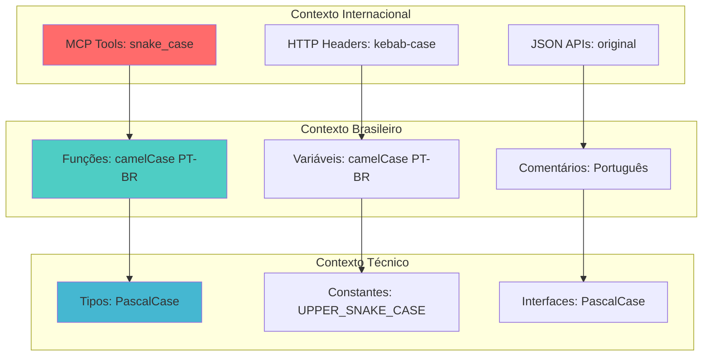

# Convenções de Nomenclatura

> **Metadados do Documento**
> - **Categoria**: Desenvolvimento
> - **Nível**: Básico
> - **Tempo de Leitura**: 8 minutos
> - **Última Atualização**: ${new Date().toLocaleDateString('pt-BR')}
> - **Versão**: 1.0.0

## 📋 Índice

- [Introdução](#introdução)
- [Sistema Híbrido PT-BR](#sistema-híbrido-pt-br)
- [Convenções por Categoria](#convenções-por-categoria)
- [Exemplos Práticos](#exemplos-práticos)
- [Validação Automática](#validação-automática)

## 🎯 Introdução

O MCP DadosBR adota um **sistema híbrido de nomenclatura** que combina padrões técnicos internacionais com clareza em português brasileiro. Esta abordagem facilita a contribuição de desenvolvedores brasileiros mantendo compatibilidade com padrões da indústria.

### Filosofia da Nomenclatura

**Princípio**: "Técnico quando necessário, português quando possível"

- **Termos MCP**: Seguem padrão internacional obrigatório
- **Lógica interna**: Usa português para clareza
- **APIs externas**: Mantém nomenclatura original
- **Documentação**: Sempre em português brasileiro

## 🌐 Sistema Híbrido PT-BR

### Mapa de Contextos



## 📝 Convenções por Categoria

### 1. Ferramentas MCP (Obrigatório Internacional)

| Elemento | Convenção | Exemplo | Justificativa |
|----------|-----------|---------|---------------|
| **Nome da Ferramenta** | `snake_case` | `cnpj_lookup` | Padrão MCP obrigatório |
| **Parâmetros** | `snake_case` | `cnpj`, `cep` | Compatibilidade JSON |
| **Descrição** | Português claro | "Consulta dados de empresa por CNPJ" | Clareza para usuários BR |

```typescript
// ✅ CORRETO - Padrão MCP
{
  name: "cnpj_lookup",
  description: "Consulta dados de empresa brasileira por CNPJ",
  inputSchema: {
    type: "object",
    properties: {
      cnpj: {
        type: "string",
        description: "CNPJ da empresa (com ou sem formatação)"
      }
    }
  }
}

// ❌ INCORRETO - Não seguir padrão MCP
{
  name: "consultarCnpj", // Deve ser snake_case
  description: "Query company data by CNPJ", // Deve ser português
}
```

### 2. Funções Internas (Português Brasileiro)

| Tipo | Convenção | Exemplo | Contexto |
|------|-----------|---------|----------|
| **Função Pública** | `camelCase` + verbo PT-BR | `buscarDadosCnpj()` | Lógica principal |
| **Função Utilitária** | `camelCase` + ação PT-BR | `validarEntrada()` | Helpers internos |
| **Função de Cache** | `camelCase` + operação | `obterDoCache()` | Operações de cache |
| **Função de API** | `camelCase` + fetch + tipo | `fetchDadosCnpj()` | Integração externa |

```typescript
// ✅ CORRETO - Funções em português brasileiro
async function buscarDadosCnpj(cnpj: string): Promise<DadosEmpresa> {
  const cnpjNormalizado = normalizarCnpj(cnpj);
  const dadosCache = obterDoCache(`cnpj:${cnpjNormalizado}`);
  
  if (dadosCache) {
    return dadosCache;
  }
  
  return await fetchDadosCnpjAPI(cnpjNormalizado);
}

function normalizarCnpj(cnpj: string): string {
  return cnpj.replace(/\D/g, "");
}

function validarFormatoCnpj(cnpj: string): boolean {
  return /^\d{14}$/.test(cnpj);
}

// ❌ INCORRETO - Mistura de idiomas
async function fetchCnpjDados(cnpj: string) { // Inglês + português
  const normalizedCnpj = normalizarCnpj(cnpj); // Mistura idiomas
}
```

### 3. Tipos e Interfaces (PascalCase Descritivo)

| Elemento | Convenção | Exemplo | Descrição |
|----------|-----------|---------|-----------|
| **Interface de Dados** | `PascalCase` + substantivo | `DadosEmpresa` | Estruturas de dados BR |
| **Tipo de Resposta** | `PascalCase` + Resposta | `RespostaCnpj` | Respostas de API |
| **Enum de Status** | `PascalCase` + categoria | `SituacaoEmpresa` | Estados brasileiros |
| **Tipo Utilitário** | `PascalCase` + função | `ChaveCache` | Tipos auxiliares |

```typescript
// ✅ CORRETO - Tipos descritivos em português
interface DadosEmpresa {
  cnpj: string;
  razaoSocial: string;
  nomeFantasia?: string;
  situacao: SituacaoEmpresa;
  dataAbertura: string;
  endereco: EnderecoEmpresa;
}

interface EnderecoEmpresa {
  logradouro: string;
  numero: string;
  complemento?: string;
  bairro: string;
  cidade: string;
  uf: EstadoBrasileiro;
  cep: string;
}

enum SituacaoEmpresa {
  ATIVA = 'ATIVA',
  SUSPENSA = 'SUSPENSA',
  INAPTA = 'INAPTA',
  BAIXADA = 'BAIXADA'
}

type EstadoBrasileiro = 
  | 'AC' | 'AL' | 'AP' | 'AM' | 'BA' | 'CE' | 'DF' | 'ES' 
  | 'GO' | 'MA' | 'MT' | 'MS' | 'MG' | 'PA' | 'PB' | 'PR' 
  | 'PE' | 'PI' | 'RJ' | 'RN' | 'RS' | 'RO' | 'RR' | 'SC' 
  | 'SP' | 'SE' | 'TO';

// ❌ INCORRETO - Nomes genéricos ou em inglês
interface CompanyData { // Deve ser português
  cnpj: string;
}

interface Data { // Muito genérico
  info: any; // Tipo any não é descritivo
}
```

### 4. Constantes (UPPER_SNAKE_CASE Técnico)

| Categoria | Convenção | Exemplo | Justificativa |
|-----------|-----------|---------|---------------|
| **Configuração** | `UPPER_SNAKE_CASE` | `TIMEOUT_PADRAO` | Valores imutáveis |
| **URLs de API** | `UPPER_SNAKE_CASE` | `API_CNPJ_URL` | Endpoints externos |
| **Mensagens** | `UPPER_SNAKE_CASE` | `ERRO_CNPJ_INVALIDO` | Textos fixos |
| **Limites** | `UPPER_SNAKE_CASE` | `CACHE_MAX_SIZE` | Valores de sistema |

```typescript
// ✅ CORRETO - Constantes técnicas claras
const TIMEOUT_PADRAO = 8000; // 8 segundos
const CACHE_TTL_CNPJ = 60 * 1000; // 60 segundos
const CACHE_TTL_CEP = 5 * 60 * 1000; // 5 minutos
const CACHE_MAX_SIZE = 256; // Máximo de entradas

const API_URLS = {
  CNPJ: "https://api.opencnpj.org",
  CEP: "https://opencep.com/v1"
} as const;

const MENSAGENS_ERRO = {
  CNPJ_INVALIDO: "CNPJ deve ter 14 dígitos",
  CEP_INVALIDO: "CEP deve ter 8 dígitos",
  CNPJ_NAO_ENCONTRADO: "CNPJ não encontrado na base de dados",
  TIMEOUT_REQUISICAO: "Timeout na consulta. Verifique sua conexão"
} as const;

// ❌ INCORRETO - Inconsistência ou português em constantes
const timeoutPadrao = 8000; // Deve ser UPPER_SNAKE_CASE
const TIMEOUT_DEFAULT = 8000; // Deve ser português quando possível
const mensagemErro = "Erro"; // Deve ser constante
```

### 5. Variáveis Locais (camelCase Contextual)

| Contexto | Convenção | Exemplo | Uso |
|----------|-----------|---------|-----|
| **Dados Brasileiros** | `camelCase` PT-BR | `dadosEmpresa` | Variáveis de negócio |
| **Dados de API** | `camelCase` original | `responseData` | Dados externos |
| **Controle de Fluxo** | `camelCase` técnico | `isValid` | Lógica de controle |
| **Temporárias** | `camelCase` descritivo | `cnpjNormalizado` | Processamento |

```typescript
// ✅ CORRETO - Variáveis contextuais
async function processarConsultaCnpj(cnpjEntrada: string) {
  // Dados de entrada (português)
  const cnpjNormalizado = normalizarCnpj(cnpjEntrada);
  const chaveCache = `cnpj:${cnpjNormalizado}`;
  
  // Dados de negócio (português)
  const dadosEmpresa = await buscarDadosCnpj(cnpjNormalizado);
  const situacaoAtiva = dadosEmpresa.situacao === 'ATIVA';
  
  // Dados técnicos (inglês quando apropriado)
  const responseTime = Date.now() - startTime;
  const isSuccess = dadosEmpresa !== null;
  
  // Resultado (português)
  const resultadoConsulta = {
    empresa: dadosEmpresa,
    tempoResposta: responseTime,
    sucesso: isSuccess
  };
  
  return resultadoConsulta;
}

// ❌ INCORRETO - Inconsistência
async function processarConsultaCnpj(cnpjInput: string) { // Mistura idiomas
  const companyData = await buscarDadosCnpj(cnpjInput); // Inglês para dados BR
  const tempoResponse = Date.now(); // Mistura idiomas
}
```

## 💡 Exemplos Práticos

### Exemplo Completo: Consulta de CNPJ

```typescript
// ===== TIPOS E INTERFACES =====
interface DadosEmpresa {
  cnpj: string;
  razaoSocial: string;
  nomeFantasia?: string;
  situacao: SituacaoEmpresa;
  endereco: EnderecoEmpresa;
}

enum SituacaoEmpresa {
  ATIVA = 'ATIVA',
  SUSPENSA = 'SUSPENSA',
  INAPTA = 'INAPTA',
  BAIXADA = 'BAIXADA'
}

type RespostaCnpj = {
  ok: true;
  dados: DadosEmpresa;
  fonte: string;
} | {
  ok: false;
  erro: string;
  codigo: string;
};

// ===== CONSTANTES =====
const TIMEOUT_CONSULTA_CNPJ = 8000;
const CACHE_TTL_DADOS_EMPRESA = 60 * 1000;
const API_CNPJ_BASE_URL = "https://api.opencnpj.org";

const MENSAGENS_VALIDACAO = {
  CNPJ_VAZIO: "CNPJ é obrigatório",
  CNPJ_FORMATO_INVALIDO: "CNPJ deve ter 14 dígitos",
  CNPJ_NAO_ENCONTRADO: "CNPJ não encontrado na Receita Federal"
} as const;

// ===== FUNÇÕES UTILITÁRIAS =====
function normalizarCnpj(cnpj: string): string {
  return cnpj.replace(/\D/g, "");
}

function validarFormatoCnpj(cnpj: string): boolean {
  const cnpjLimpo = normalizarCnpj(cnpj);
  return cnpjLimpo.length === 14 && /^\d+$/.test(cnpjLimpo);
}

function gerarChaveCacheCnpj(cnpj: string): string {
  return `cnpj:${normalizarCnpj(cnpj)}`;
}

// ===== FUNÇÃO PRINCIPAL =====
async function consultarDadosEmpresa(cnpjEntrada: string): Promise<RespostaCnpj> {
  // Validação de entrada
  if (!cnpjEntrada?.trim()) {
    return {
      ok: false,
      erro: MENSAGENS_VALIDACAO.CNPJ_VAZIO,
      codigo: 'CNPJ_VAZIO'
    };
  }

  // Normalização
  const cnpjNormalizado = normalizarCnpj(cnpjEntrada);
  
  if (!validarFormatoCnpj(cnpjNormalizado)) {
    return {
      ok: false,
      erro: MENSAGENS_VALIDACAO.CNPJ_FORMATO_INVALIDO,
      codigo: 'CNPJ_INVALIDO'
    };
  }

  // Verificar cache
  const chaveCache = gerarChaveCacheCnpj(cnpjNormalizado);
  const dadosCache = obterDoCache(chaveCache);
  
  if (dadosCache) {
    return {
      ok: true,
      dados: dadosCache as DadosEmpresa,
      fonte: 'cache'
    };
  }

  // Consultar API
  try {
    const dadosEmpresa = await buscarDadosEmpresaAPI(cnpjNormalizado);
    
    // Armazenar no cache
    armazenarNoCache(chaveCache, dadosEmpresa, CACHE_TTL_DADOS_EMPRESA);
    
    return {
      ok: true,
      dados: dadosEmpresa,
      fonte: API_CNPJ_BASE_URL
    };
    
  } catch (erro) {
    return {
      ok: false,
      erro: erro.message,
      codigo: erro.code || 'ERRO_DESCONHECIDO'
    };
  }
}

// ===== INTEGRAÇÃO COM API =====
async function buscarDadosEmpresaAPI(cnpj: string): Promise<DadosEmpresa> {
  const controller = new AbortController();
  const timeoutId = setTimeout(() => controller.abort(), TIMEOUT_CONSULTA_CNPJ);

  try {
    const response = await fetch(`${API_CNPJ_BASE_URL}/${cnpj}`, {
      signal: controller.signal,
      headers: {
        'Accept': 'application/json',
        'User-Agent': 'MCP-DadosBR/1.2.0'
      }
    });

    clearTimeout(timeoutId);

    if (response.status === 404) {
      throw new Error(MENSAGENS_VALIDACAO.CNPJ_NAO_ENCONTRADO);
    }

    if (!response.ok) {
      throw new Error(`Erro HTTP ${response.status}: ${response.statusText}`);
    }

    const dadosAPI = await response.json();
    
    // Mapear resposta da API para nossa interface
    return mapearDadosEmpresaAPI(dadosAPI);
    
  } catch (erro) {
    clearTimeout(timeoutId);
    
    if (erro.name === 'AbortError') {
      throw new Error('Timeout na consulta. Verifique sua conexão');
    }
    
    throw erro;
  }
}

function mapearDadosEmpresaAPI(dadosAPI: any): DadosEmpresa {
  return {
    cnpj: dadosAPI.cnpj,
    razaoSocial: dadosAPI.razao_social,
    nomeFantasia: dadosAPI.nome_fantasia,
    situacao: dadosAPI.situacao as SituacaoEmpresa,
    endereco: {
      logradouro: dadosAPI.endereco.logradouro,
      numero: dadosAPI.endereco.numero,
      bairro: dadosAPI.endereco.bairro,
      cidade: dadosAPI.endereco.cidade,
      uf: dadosAPI.endereco.uf,
      cep: dadosAPI.endereco.cep
    }
  };
}

// ===== FERRAMENTA MCP (Padrão Internacional) =====
const ferramentaCnpjLookup = {
  name: "cnpj_lookup", // snake_case obrigatório
  description: "Consulta dados de empresa brasileira por CNPJ",
  inputSchema: {
    type: "object",
    properties: {
      cnpj: {
        type: "string",
        description: "CNPJ da empresa (com ou sem formatação)"
      }
    },
    required: ["cnpj"]
  }
};
```

## ✅ Validação Automática

### Regras de Linting

```typescript
// .eslintrc.js - Regras customizadas para nomenclatura
module.exports = {
  rules: {
    // Funções devem usar camelCase
    'camelcase': ['error', { 
      properties: 'never',
      ignoreDestructuring: true,
      allow: ['^cnpj_', '^cep_'] // Exceção para ferramentas MCP
    }],
    
    // Constantes devem usar UPPER_SNAKE_CASE
    '@typescript-eslint/naming-convention': [
      'error',
      {
        selector: 'variable',
        modifiers: ['const'],
        format: ['UPPER_CASE', 'camelCase'],
        filter: {
          regex: '^[A-Z][A-Z_]*$',
          match: true
        }
      },
      {
        selector: 'interface',
        format: ['PascalCase'],
        custom: {
          regex: '^[A-Z][a-zA-Z]*$',
          match: true
        }
      }
    ]
  }
};
```

### Validador de Nomenclatura

```typescript
// Validador customizado para convenções brasileiras
class ValidadorNomenclatura {
  static validarFuncao(nome: string): boolean {
    // Deve ser camelCase e começar com verbo em português
    const verbosValidos = [
      'buscar', 'obter', 'consultar', 'validar', 'normalizar',
      'processar', 'mapear', 'converter', 'gerar', 'criar'
    ];
    
    const isCamelCase = /^[a-z][a-zA-Z0-9]*$/.test(nome);
    const comecaComVerbo = verbosValidos.some(verbo => nome.startsWith(verbo));
    
    return isCamelCase && comecaComVerbo;
  }
  
  static validarConstante(nome: string): boolean {
    // Deve ser UPPER_SNAKE_CASE
    return /^[A-Z][A-Z0-9_]*$/.test(nome);
  }
  
  static validarInterface(nome: string): boolean {
    // Deve ser PascalCase e substantivo descritivo
    const substantivosValidos = [
      'Dados', 'Resposta', 'Resultado', 'Configuracao', 'Entrada',
      'Saida', 'Empresa', 'Endereco', 'Cache', 'Erro'
    ];
    
    const isPascalCase = /^[A-Z][a-zA-Z0-9]*$/.test(nome);
    const contemSubstantivo = substantivosValidos.some(sub => nome.includes(sub));
    
    return isPascalCase && contemSubstantivo;
  }
  
  static validarFerramentaMCP(nome: string): boolean {
    // Deve ser snake_case e terminar com _lookup
    return /^[a-z]+_lookup$/.test(nome);
  }
}
```

### Checklist de Nomenclatura

```markdown
## ✅ Checklist de Nomenclatura

### Ferramentas MCP
- [ ] Nome em snake_case (ex: `cnpj_lookup`)
- [ ] Descrição em português brasileiro
- [ ] Parâmetros em snake_case
- [ ] Documentação clara em PT-BR

### Funções
- [ ] camelCase com verbo em português
- [ ] Nome descritivo da ação
- [ ] Parâmetros com nomes claros
- [ ] Comentários JSDoc em português

### Tipos e Interfaces
- [ ] PascalCase descritivo
- [ ] Nomes em português quando apropriado
- [ ] Propriedades bem documentadas
- [ ] Uso de union types para estados

### Constantes
- [ ] UPPER_SNAKE_CASE
- [ ] Valores imutáveis
- [ ] Agrupadas logicamente
- [ ] Comentários explicativos

### Variáveis
- [ ] camelCase contextual
- [ ] Português para dados brasileiros
- [ ] Inglês para dados técnicos
- [ ] Nomes descritivos e claros
```

## 🚀 Próximos Passos

Agora que você domina as convenções de nomenclatura:

1. **[Padrões de Implementação](padroes-implementacao.md)** - Como aplicar essas convenções no código
2. **[Configuração do Ambiente](configuracao-ambiente.md)** - Setup de linting e validação
3. **[Exemplos Básicos](../exemplos/basicos/)** - Ver as convenções em prática

---

**💡 Dica**: Use o validador automático durante o desenvolvimento. Nomenclatura consistente facilita muito a manutenção por outros desenvolvedores brasileiros.

**🏷️ Tags**: nomenclatura, convenções, português-brasileiro, padrões, desenvolvimento